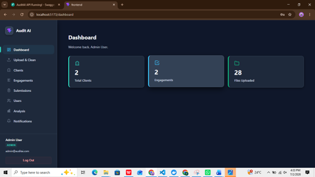
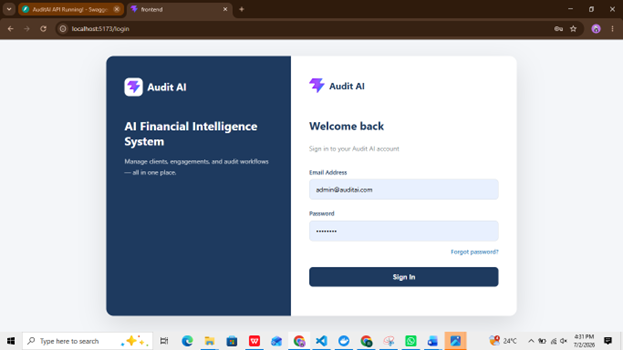
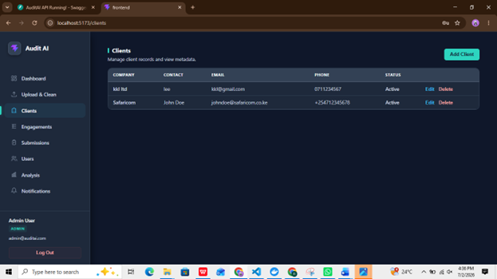
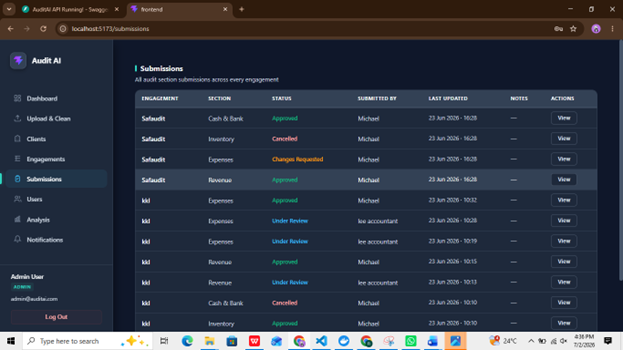
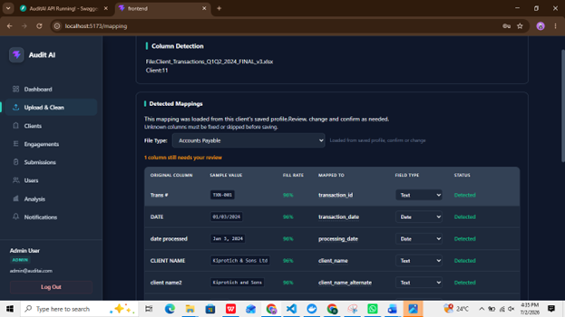
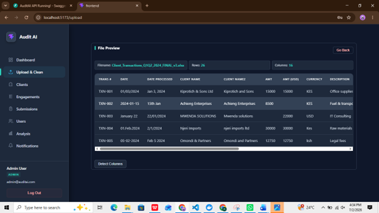
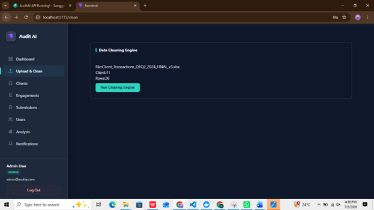
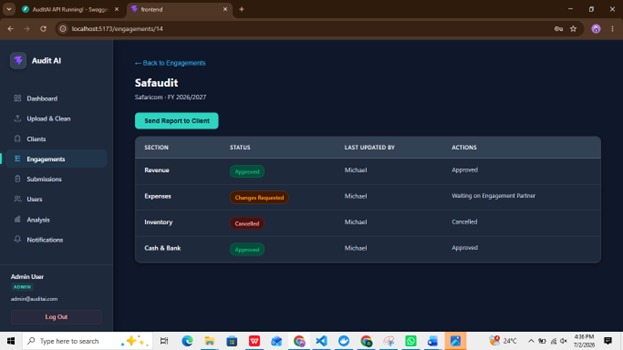

# Audit AI

Audit AI is an AI-powered auditing platform designed to help auditors work with financial data more efficiently. The platform supports intelligent data processing, financial analysis, and validation workflows to streamline audit activities.

## Overview

I contribute to the AI and data processing components of the platform, including:

- Schema detection and column mapping
- Data cleaning and validation
- Financial data analysis
- Trial balance validation
- AI-assisted audit workflows

## Technologies Used

- Python
- FastAPI
- Pandas
- React
- Large Language Models (LLMs)
- Retrieval-Augmented Generation (RAG)
- Git

## Screenshots

### Dashboard

### Login Page

### Client Management

### Data Submission

### Schema Detection

### Data Cleaning

### Validation & Processing

### Engagement Management

## Project Status

🚧 This project is currently under development and continues to evolve with new AI-powered auditing and financial analysis features.
